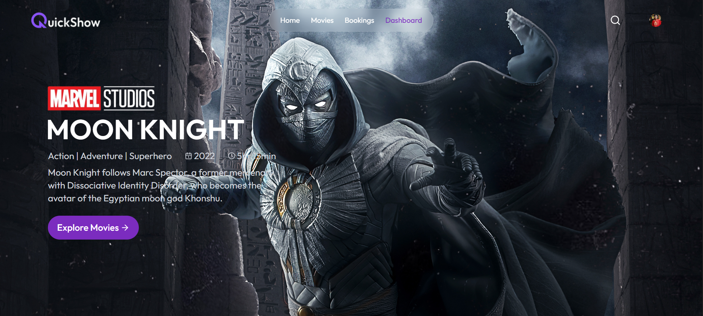
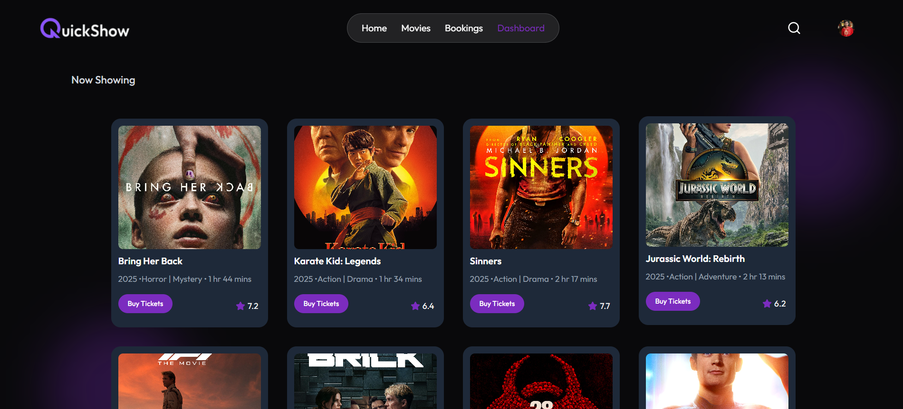
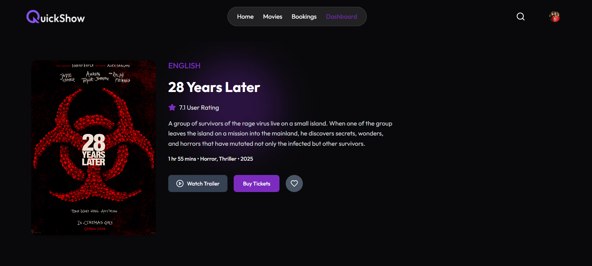
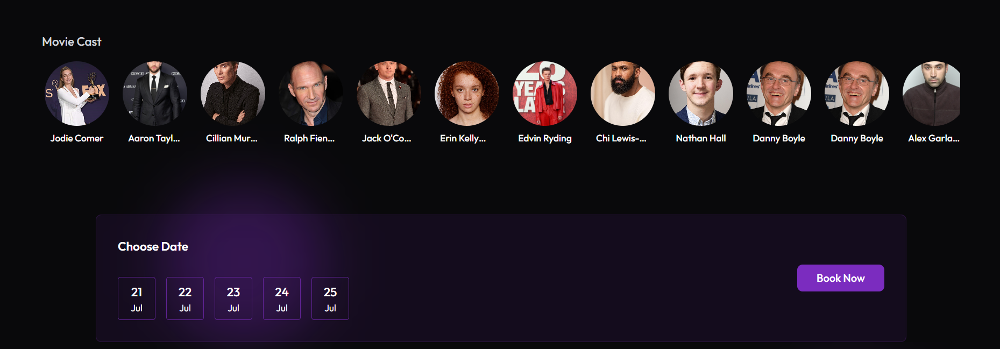
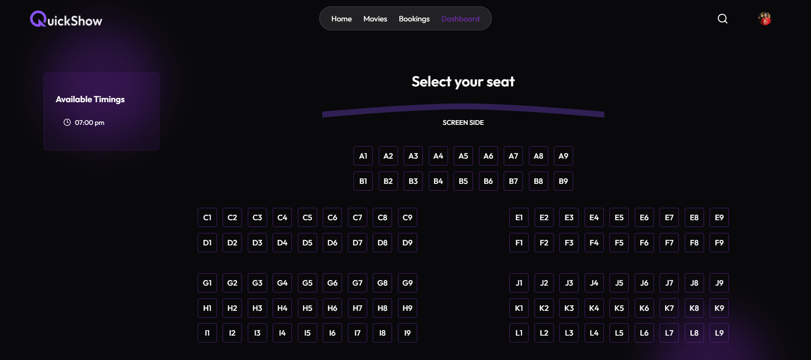
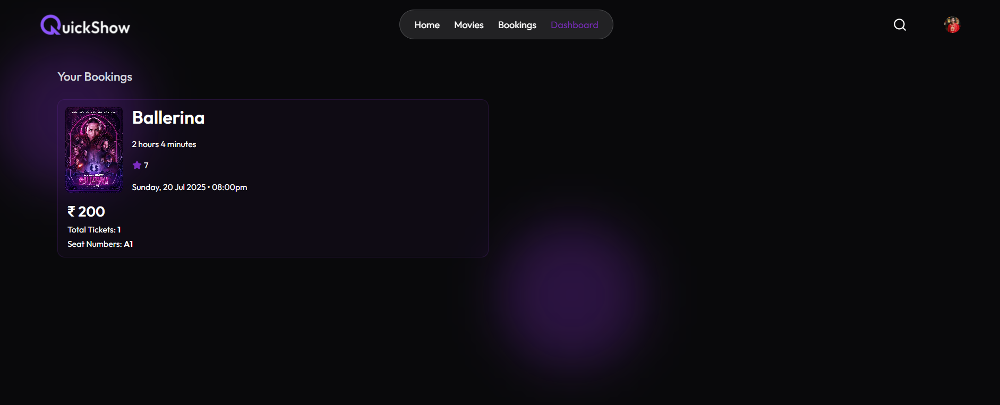
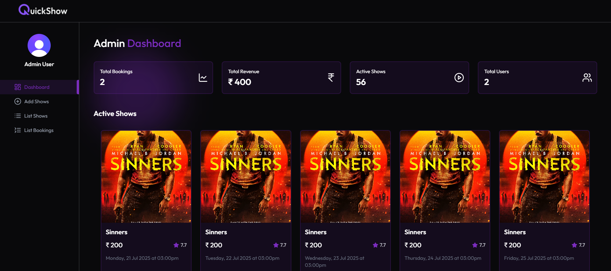
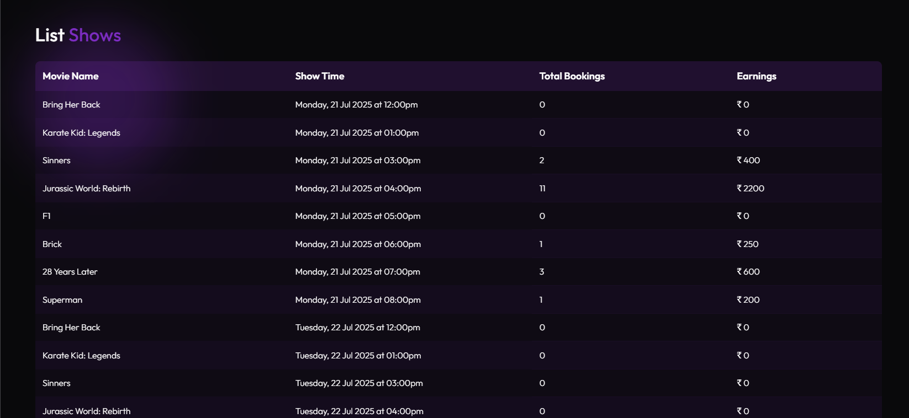
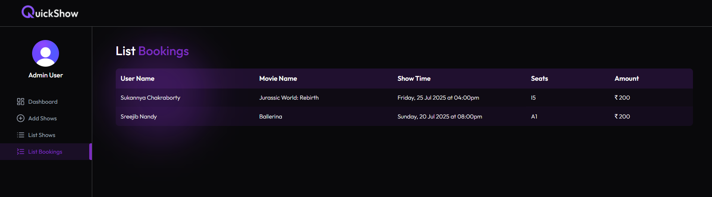

# SpingleShow – MERN Movie Ticket Booking System
### A fully functional full-stack MERN movie ticket booking web app built with Inngest, Nodemailer, Stripe, and Clerk for a seamless and secure movie experience.

### 🚀 Features : --
🎟️ Book movie tickets with live seat selection

🔐 Authentication via Clerk

💳 Secure Payments using Stripe

📧 Email Notifications with Nodemailer

⏱️ Background Jobs using Inngest

🧾 Admin Dashboard to manage movies, shows, and revenue

📊 Monthly revenue and booking analytics

### 📚 Documentation : --
🎨 Folder Structure & .env Example - [Guide](./DOCUMENTATION.md)

### Home Page

### Movies Page

### Movie Details Page

### Cast & Dates

### Seat Layout Page

### Bookings Page

### Dashboard Page

### List Shows Page

### List Bookings Page

### 👨‍💻 Author : --
## Ishmeet Singh
🔗 GitHub: https://github.com/Ishmeet04

## ⭐ If you like this project, don’t forget to star the repo!
